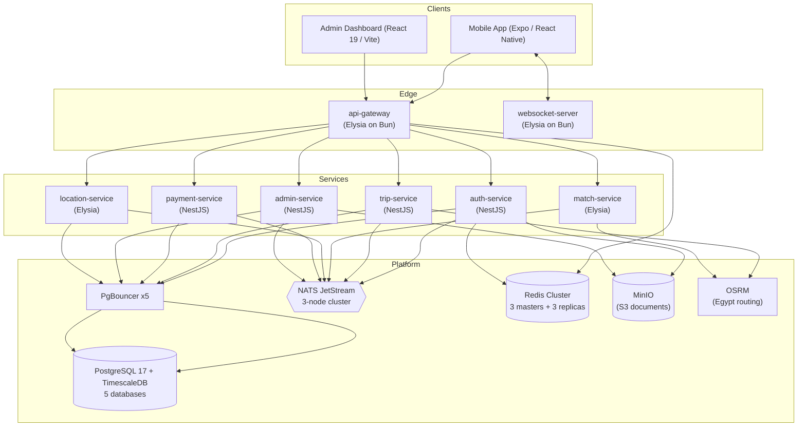

# Ain Rider

Ride-hailing platform for Egypt: a rider + driver mobile app, an Arabic-first admin dashboard, and an event-driven microservices backend — in one Turborepo monorepo.

Designed, built, and owned end-to-end with AI-assisted development: system design, infrastructure, backend services, mobile app, and dashboard.

- Phone auth works with Egyptian numbers only (`+20`), currency is EGP
- Arabic RTL first: the dashboard UI and user-facing copy are Arabic
- Every service is independently runnable and independently deployable

## System design



### Services

| Service | Runtime | Responsibility |
| --- | --- | --- |
| `api-gateway` | Elysia (Bun) | Public BFF. JWT verification, rate limiting, Swagger, proxies to internal services |
| `auth-service` | NestJS | Users, roles, OTP login (provider-agnostic), JWT access/refresh tokens |
| `trip-service` | NestJS | Trip lifecycle, fare estimation, OSRM routing |
| `match-service` | Elysia | Driver–rider matching |
| `location-service` | Elysia | Live driver locations, TimescaleDB hypertable |
| `websocket-server` | Elysia (Bun) | Real-time trip and driver updates |
| `payment-service` | NestJS | Payments, refunds, driver wallets (cash-first) |
| `admin-service` | NestJS | Shadow users, document verification, complaints, promos, fleet, notifications |

The backend keeps its own internal monorepo layout under [`apps/backend`](apps/backend) with 8 more shared packages:

| Package | Responsibility |
| --- | --- |
| `@ain-rider/shared-types` | Shared TypeScript types across services and apps |
| `@ain-rider/nats-client` | JetStream wrapper: streams, consumers, DLQ, idempotency, tracing |
| `@ain-rider/redis-client` | Redis Cluster client, caching helpers |
| `@ain-rider/internal-api` | Authenticated service-to-service HTTP calls |
| `@ain-rider/error-handling` | Typed error hierarchy, mappers, Elysia + Nest adapters |
| `@ain-rider/metrics` | Metrics controllers/interceptors for Nest and Elysia |
| `@ain-rider/minio-client` | S3-compatible document storage (bucket: `ain-rider`) |
| `@ain-rider/config` | Shared configuration loading |

### Key design decisions

- **Database-per-service.** One Postgres instance hosts 5 databases (`ainrider_auth`, `ainrider_admin`, `ainrider_trip`, `ainrider_payment`, `ainrider_location`). Each service owns its schema via Prisma and goes through its own PgBouncer (transaction pooling). No service reads another service's database — cross-service data flows through NATS events or the internal API.
- **Event-driven backbone.** NATS JetStream (3-node cluster) with subjects under `ain_rider.*`. Events carry versioned envelopes; consumers get a dead-letter queue and idempotency guards.
- **OTP is provider-agnostic.** A single `OTP_PROVIDER` env var switches between console (dev), Firebase Auth, Twilio, Infobip, or Unifonic without touching mobile code or endpoints.
- **Egyptian phones enforced everywhere.** `+20` E.164 format is validated on the mobile app, the dashboard, the API gateway models, and the backend DTOs. One regex, one truth.
- **Bun as a runtime, not a package manager.** Elysia services run and build with Bun; pnpm manages every dependency from the monorepo root.

## Local infrastructure (Docker Compose)

`pnpm docker:infra:up` starts the full platform:

| Component | Image | Ports | Notes |
| --- | --- | --- | --- |
| PostgreSQL | `timescale/timescaledb-ha:pg17` | 5433 | 5 databases, init script creates them |
| PgBouncer x5 | `edoburu/pgbouncer` | 5434–5438 | One pool per database |
| Redis Cluster | `redis:7.4-alpine` x6 | 6379–6384 | 3 masters + 3 replicas, AOF |
| RedisInsight | `redis/redisinsight` | 5540 | Cluster UI |
| NATS JetStream | `nats:2.10-alpine` x3 | 4222–4224, 8222–8224 | Cluster + monitoring |
| MinIO | `minio/minio` | 9000, 9001 | Bucket `ain-rider` auto-created |
| OSRM | `osrm-backend v6` | 5000 | Egypt map, MLD algorithm |

The dev compose intentionally runs clustered replicas (Redis Cluster, NATS cluster, PgBouncer pools) so clustering behavior is tested locally, not only in production.

## Production direction

The Compose stack is the development and integration environment. Production targets **AWS EKS** (or ECS/EC2 behind an ELB if EKS is not used):

- Services are stateless — scale horizontally per service
- Configuration is environment-based; no config in code
- Per-service databases map to separate RDS/persisted volumes
- NATS and Redis cluster topologies carry over from the dev setup

## Tech stack

| Layer | Technology |
| --- | --- |
| Monorepo | Turborepo + pnpm workspaces |
| Backend (4 services) | NestJS 11, Prisma 7, class-validator |
| Backend (4 services) | Elysia, Bun runtime |
| Mobile | Expo 54, React Native 0.81, expo-router, Zustand, NativeWind |
| Dashboard | React 19, Vite, TanStack Query, Tailwind CSS 4, shadcn-style UI |
| Data | PostgreSQL 17 (TimescaleDB), Prisma, PgBouncer |
| Messaging | NATS JetStream |
| Cache / realtime state | Redis Cluster |
| Storage | MinIO (S3) |
| Routing | OSRM (self-hosted Egypt map) |
| Auth | Phone OTP + JWT (access/refresh), Firebase Admin optional |

## Getting started

Prerequisites: Node 22+, pnpm 10, Bun (runtime for Elysia services), Docker.

```bash
# 1. Install everything (runs prisma generate automatically)
pnpm install

# 2. Fetch and preprocess the OSRM Egypt map (~170 MB download, one time)
pwsh apps/backend/scripts/setup-osrm.ps1   # or: bash apps/backend/scripts/setup-osrm.sh

# 3. Start the platform: Postgres, PgBouncers, Redis Cluster, NATS, MinIO, OSRM
pnpm docker:infra:up

# 4. Copy the .env.example files in each service you run and fill values

# 5. Run all backend services + dashboard (turbo, parallel)
pnpm dev

# Mobile app (separate terminal)
pnpm -C apps/mobile start
```

The OSRM map data is generated from the [Geofabrik](https://download.geofabrik.de/africa/egypt.html) Egypt extract and is not committed to git.

Useful commands:

```bash
pnpm build             # build everything (turbo, cached)
pnpm lint              # lint everything
pnpm test              # run all tests
pnpm prisma:generate   # regenerate Prisma clients
pnpm docker:infra:down # stop the platform
```

The API gateway serves on `http://localhost:3000` (Swagger docs included). Nest services use ports 4000+. The dashboard points at the gateway via `VITE_API_GATEWAY_URL`.

## Project structure

```text
apps/
  backend/                 backend monorepo
    apps/elysia/           api-gateway, location-service, match-service, websocket-server
    apps/nest/             auth-service, admin-service, trip-service, payment-service
    packages/              8 shared @ain-rider/* packages
    docker-compose.yml     full local platform
  dashboard/               admin dashboard (Vite + React)
  mobile/                  rider + driver app (Expo)
docs/                      project documentation (docs/archive holds old specs)
```

## Roadmap

- [x] **CI pipeline** — GitHub Actions: install, build, and typecheck on every push with Turborepo caching
- [ ] **Secrets management** — move `.env` values and service keys into a proper secret flow for CI and production
- [ ] **Observability** — distributed tracing and dashboards for the gateway and services (tooling under evaluation)
- [ ] **Test coverage** — unit and integration tests starting with the critical paths: fare estimation, OTP flow, matching
- [ ] **Slim dev profile** — a lighter Compose profile (single Redis, single NATS) for day-to-day development

## License

All rights reserved.
